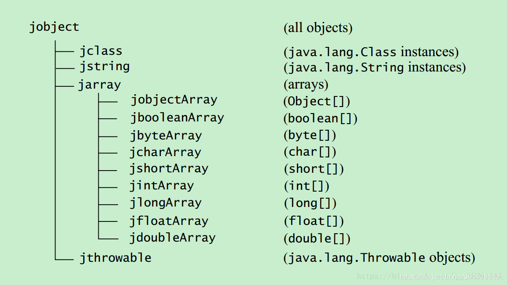

## 目录

1. 01My Application     NDK项目创建
2. 02My Application   Kotlin云JNI的交互
   1.CMake的语法和实践
   2.在Kotlin中调用JNI的函数

3.03My Application  动态注册  项目够失败

4.04My Application  基本数据类型的转换

5.05My Application 字符串转换

6.06My Application  引用类型的转换

7.07My APPlication  JNI方法java字段
    1.实体类静态和非静态变量的操作
    2.this 静态变量和静态方法的操作
8.08My APPlication 回调java方法
   1.回调实体类方法
   2.回调静态方法
9.09My APPlication 访问java方法
10.10My APPlication jni线程访问java 接口
11.11My APPlication 全局引用 局部引用 弱引用
12.12My APPlication 异常处理 异常抛出
13.13My APPlication 创建线程 创建线程并传入参数  线程挂起返回参数

## 基本数据类型

| Java类型  | 本地类型      | 描述                                     |
| --------- | ------------- | ---------------------------------------- |
| boolean   | jboolean      | C/C++8位整型                             |
| byte      | jbyte         | C/C++带符号的8位整型                     |
| char      | jchar         | C/C++无符号的16位整型                    |
| short     | jshort        | C/C++带符号的16位整型                    |
| int       | jint          | C/C++带符号的32位整型                    |
| long      | jlong         | C/C++带符号的64位整型e                   |
| float     | jfloat        | C/C++32位浮点型                          |
| double    | jdouble       | C/C++64位浮点型                          |

## 引用数据类型

| Object    | jobject       | 任何Java对象，或者没有对应java类型的对象 |
| --------- | ------------- | ---------------------------------------- |
| Class     | jclass        | Class对象                                |
| String    | jstring       | 字符串对象                               |
| Object[]  | jobjectArray  | 任何对象的数组                           |
| boolean[] | jbooleanArray | 布尔型数组                               |
| byte[]    | jbyteArray    | 比特型数组                               |
| char[]    | jcharArray    | 字符型数组                               |
| short[]   | jshortArray   | 短整型数组                               |
| int[]     | jintArray     | 整型数组                                 |
| long[]    | jlongArray    | 长整型数组                               |
| float[]   | jfloatArray   | 浮点型数组                               |
| double[]  | jdoubleArray  | 双浮点型数组                             |

引用类型以及关系

## 字段数据类型

| Java 类型 | 符号 |
| --------- | ---- |
| boolean   | Z    |
| byte      | B    |
| char      | C    |
| short     | S    |
| int       | I    |
| long      | L    |
| float     | F    |
| double    | D    |
| void      | V    |

| Field Descriptor        | Java Language Type |
| :---------------------- | :----------------- |
| `"Ljava/lang/String;"`  | `String`           |
| `"[I"`                  | `int[]`            |
| `"[Ljava/lang/Object;"` | `Object[]`         |

## 函数

| Method Descriptor         | Java Language Type        |
| :------------------------ | :------------------------ |
| `"()Ljava/lang/String;"`  | `String f();`             |
| `"(ILjava/lang/Class;)J"` | `long f(int i, Class c);` |
| `"([B)V"`                 | `String(byte[] bytes);`   |